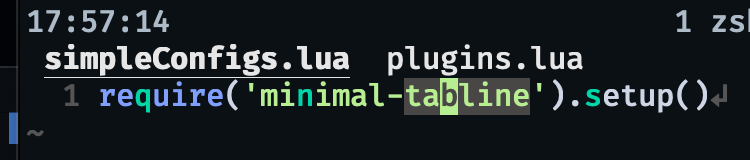

# Minimal-tabline.nvim

This is a minimal tabline, that's it.



## Installation

Make sure you are using Neovim (v0.6.0) or the latest neovim nightly.

Using [vim-plug](https://github.com/junegunn/vim-plug)

```viml
Plug 'koenverburg/minimal-tabline.nvim'
```

Using [dein](https://github.com/Shougo/dein.vim)

```viml
call dein#add('koenverburg/minimal-tabline.nvim')
```
Using [packer.nvim](https://github.com/wbthomason/packer.nvim)

```lua
use 'koenverburg/minimal-tabline.nvim'
```
## Customization

The layout of the tab is as follows `<index> <filename> <modified_sign> (<N of panes>)`.
The `tab_index`, `pane_count` are turned off by default but can be turned on as desired. This also counts for the `modified_sign` which can be turn off, its on by default.

```lua
require('minimal-tabline').setup({
  enable = true,
  file_name = true,
  tab_index = false,
  pane_count = false,
  modified_sign = true,
  hide_on_single_tab = true,
  no_name = '[No Name]'
})
```

## Related Projects

- [romgrk/barbar.nvim](https://github.com/romgrk/barbar.nvim)
- [akinsho/bufferline.nvim](https://github.com/akinsho/bufferline.nvim)
- [crispgm/nvim-tabline](https://github.com/crispgm/nvim-tabline)
- [alvarosevilla95/luatab.nvim](https://github.com/alvarosevilla95/luatab.nvim)
- [johann2357/nvim-smartbufs](https://github.com/johann2357/nvim-smartbufs)
- [kdheepak/tabline.nvim](https://github.com/kdheepak/tabline.nvim)
- [noib3/cokeline.nvim](https://github.com/noib3/cokeline.nvim)
